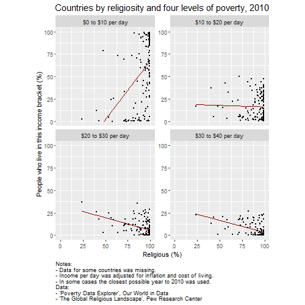

```{r setup, include=FALSE}
# Do not change these settings!
knitr::opts_chunk$set(warning = FALSE, message = FALSE)
```

### Assessment declaration checklist

Please carefully read the statements below and check each box if you agree with the declaration. If you do not check all boxes, your assignment will not be marked. If you make a false declaration on any of these points, you may be investigated for academic misconduct. Students found to have breached academic integrity may receive official warnings and/or serious academic penalties. Please read more about academic integrity [here](https://www.rmit.edu.au/students/student-essentials/assessment-and-exams/academic-integrity). If you are unsure about any of these points or feel your assessment might breach academic integrity, please contact your course coordinator for support. It is important that you DO NOT submit any assessment until you can complete the declaration truthfully. 

**By checking the boxes below, I declare the following:**

_Please note, there are no check boxes available in MS Word, so     will indicate agreement._

- <input type="checkbox" id="dec1" name="dec1" value="Agree"> I have not impersonated, or allowed myself to be impersonated by, any person for the purposes of this assessment 

- <input type="checkbox" id="dec2" name="dec2" value="Agree"> This assessment is my original work and no part of it has been copied from any other source except where due acknowledgement is made. Due acknowledgement means the following:
  * The source is correctly referenced in a reference list
  * The work has been paraphrased or directly quoted
  * A citation to the original work’s reference has been included where the copied work appears in the assessment. 


- <input type="checkbox" id="dec3" name="dec3" value="Agree"> No part of this assessment has been written for me by any other person except where such collaboration has been authorised by the lecturer/teacher concerned.

- <input type="checkbox" id="dec4" name="dec4" value="Agree"> I have not used generative “AI” tools for the purposes of this assessment. 

- <input type="checkbox" id="dec4" name="dec5" value="Agree"> Where this work is being submitted for individual assessment, I declare that it is my original work and that no part has been contributed by, produced by or in conjunction with another student.

- <input type="checkbox" id="dec5" name="dec6" value="Agree"> I give permission for my assessment response to be reproduced, communicated, compared and archived for the purposes of detecting plagiarism.

- <input type="checkbox" id="dec6" name="dec7" value="Agree"> I give permission for a copy of my assessment to be retained by the university for review and comparison, including review by external examiners.

**I understand that:**

- <input type="checkbox" id="dec7" name="dec8" value="Agree"> Plagiarism is the presentation of the work, idea or creation of another person or machine as though it is your own. It is a form of cheating and is a very serious academic offence that may lead to exclusion from the University. Plagiarised material can be drawn from, and presented in, written, graphic and visual form, including electronic data and oral presentations. Plagiarism occurs when the origin of the material used is not appropriately cited.

- <input type="checkbox" id="dec8" name="dec9" value="Agree"> Plagiarism includes the act of assisting or allowing another person to plagiarise or to copy my work.

**I agree and acknowledge that:**

- <input type="checkbox" id="dec9" name="dec10" value="Agree"> I have read and understood the Declaration and Statement of Authorship above.

- <input type="checkbox" id="dec10" name="dec11" value="Agree"> If I do not agree to the Declaration and Statement of Authorship in this context and all boxes are not checked, the assessment outcome is not valid for assessment purposes and will not be included in my final result for this course.

## Deconstruct

### Original

The original data visualisation selected for the assignment was as follows:

<br>

<center>*Source: Newsweek, "Most Religious Countries in the World.*</center>
<br>


### Objective and Audience

The objective and audience of the original data visualisation chosen can be summarised as follows: 

**Objective**

News websites commonly use maps as an engagement tool. There might have been not much thought made about the best kind of data visualisation to use or what the objective of this map was. The author of this report has reason to believe this is true, based on years of experience working in newsrooms.

Assuming that the authors had an objective for this data visualisation, then the objective was to represent the geographic distribution of religiosity worldwide. The audience might be interested to see how their country compares to others.

**Audience**

Newsweek is a general news website, so the audience is a general and non-technical audience. Newsweek has news from around the world and is written for English-speaking audiences. We can expect the majority of readers will live in developed western countries.

### Critique

The visualisation chosen had the following three main issues:

*	The visualisation uses a palette of colours from across the colour spectrum, which would be appropriate for categorical data. However, the variable of interest is continuous and placed in levels, meaning that these levels have order. A sequential colour scale would be more appropriate.
*	The mapping from levels in the data to colours is confusing: “No Data” has a colour and is in the palette’s middle. The palette also does not observe any sensible order in relation to the levels of the variable of interest, which is evident from looking at the legend.
*	A map is not the right choice for this data. Many large landmasses have no data, meaning there are large gaps in the data visualisation. Also, it is somewhat interesting to see that some areas of Earth are more religious than others, but it would be more interesting to see if religiosity correlates with some other variable other than location on Earth.

The best way to address these issues is to display the data in a more appropriate chart, which would not be a map.

## Reconstruct

This visualisation would be more interesting if religiosity was plotted against some other variable, like some measure of poverty.

Using a scatter plot to see a correlation would address the issue using a colour for "No Data" in the original map, since scatter plots do not alert the audience to missing data. But a note on the visualisation should explain that some countries do not have available data. To draw the reader's attention to the correlation, each chart can have a "line of best fit". Most readers in a general audience will know what this means without understanding the regression technique.

There will be no need for a colour palette in the new visualisation, since the variable is displayed on an axis, not with colours.

The Newsweek article (Edwards, 2024) that features the map names Pew Research Center as the source of data, but Newsweek does not name the specific report. The most likely source is a report by Pew in June of 2024, called "Religion and Spirituality in East Asian Societies". The data in that report corresponds to the countries in the before-mentioned map and is displayed in a horizontal bar chart with vertical gridlines at 20%, 40%, 60% and 80%; these levels correspond to those used in the Newsweek map.

That Pew Research data was unavailable so instead this reconstruction uses another Pew Research Centre report called "The Global Religious Landscape", which was published in 2012 and includes data from 2010. That data includes "unaffiliated" to mean those people who do not follow a religion. The remainder (100-unaffiliated)% should be close to the notion of "importance of religion" that the Newsweek map displays.

Of particular interest would be this question: does religiosity correlate with poverty? To achieve this, we will combine that data with another dataset concerning poverty. A faceted data visualisation will allow for consideration of many levels of poverty severity. A good source for this is the Poverty Data Explorer by Our World in Data.

### Code

The following code was used to fix the issues identified in the original. 
Note that a small amount of data cleaning and prep was done in MS Excel.

```{r}
poverty = read.csv("poverty-explorer.csv")

poverty[, "Share.10.to.20.a.day"] <- poverty[, "Share.below..20.a.day"] -
  poverty[, "Share.below..10.a.day"]
poverty[, "Share.20.to.30.a.day"] <- poverty[, "Share.below..30.a.day"] -
  poverty[, "Share.below..20.a.day"]
poverty[, "Share.30.to.40.a.day"] <- poverty[, "Share.below..40.a.day"] -
  poverty[, "Share.below..30.a.day"]

poverty2008To2012 = poverty[poverty$Year %in% c('2008','2009','2010','2011','2012'), c("Country", "Year", "Share.below..10.a.day", "Share.10.to.20.a.day", "Share.20.to.30.a.day", "Share.30.to.40.a.day")]

# Collect data from 2010, but take the closes year if 2010 is not available.
order <- c('2010', '2011', '2009', '2012', '2008')
library(dplyr)
povertyClosestYear <- poverty2008To2012 %>% 
  arrange(factor(Year, levels = order)) %>%
  distinct(Country, .keep_all = TRUE)

religion2010 = read.csv("ReligionPerCountry_2010.csv")
religion2010$Unaffiliated = gsub('[<%]', '', religion2010$Unaffiliated)
religion2010$Unaffiliated = as.numeric(religion2010$Unaffiliated)
religion2010$Religious = 100 - religion2010$Unaffiliated
religion2010 = religion2010[,c("Country","Religious")]

mergedData = merge(povertyClosestYear, religion2010, by = "Country")
mergedData <- mergedData[,c("Share.below..10.a.day",
                            "Share.10.to.20.a.day",
                            "Share.20.to.30.a.day", 
                            "Share.30.to.40.a.day",
                            "Religious")]

# Make data long for ggplot
library(tidyr)
mergedDataLong <- mergedData %>% 
  gather(IncomeBracket, ShareInBracket, -Religious)

variable_names <- list(
  "Share.below..10.a.day" = "$0 to $10 per day" ,
  "Share.10.to.20.a.day" = "$10 to $20 per day",
  "Share.20.to.30.a.day" = "$20 to $30 per day",
  "Share.30.to.40.a.day" = "$30 to $40 per day"
)
variable_labeller <- function(variable,value){
  return(variable_names[value])
}

```

### Reconstruction

The following plot fixes the main issues in the original.

The chart shows that there is a strong correlation between religiosity and poverty, but that correlation reverses somewhat when we consider less severe poverty.

```{r}
library("ggplot2")

# This allows for directly controlling the final chart size, to be pasted in
png(filename="finalDataViz.png", width=500, height=500)

ggplot(mergedDataLong, aes(x=Religious, y=ShareInBracket)) +
  geom_point(size = 0.5) +
  theme(aspect.ratio = 1,
        plot.title = element_text(hjust = 0.5,size = 15),
        plot.caption = element_text(hjust = 0)) +
  labs(x= "Religious (%)", 
       y= "People who live in this income bracket (%)",
       title= "Countries by religiosity and four levels of poverty, 2010",
       caption = "Notes:\n- Data for some countries was missing.\n- Income per day was adjusted for inflation and cost of living.\n- In some cases the closest possible year to 2010 was used.\nData:\n- 'Poverty Data Explorer', Our World in Data\n- 'The Global Religious Landscape', Pew Research Center") +
  ylim(0,100) +
  xlim(0,100) +
  geom_smooth(method=lm, se=FALSE, linetype="solid", color="darkred", linewidth = 0.5) +
  facet_wrap(~factor(IncomeBracket, levels=c("Share.below..10.a.day",
                                             "Share.10.to.20.a.day",
                                             "Share.20.to.30.a.day",
                                             "Share.30.to.40.a.day")),
             scales="free_y", ncol=2, labeller= variable_labeller)

dev.off()

```
<br>

<br>

## References

The reference to the original data visualisation, the data sources used for the reconstruction are as follows:

- Edwards, J. (2024, August 24). Map Shows Most Religious Countries in the World. _Newsweek_. https://www.newsweek.com/map-shows-most-religious-countries-2024-1942346
- Evans, J., Cooperman, A., Starr, K. J., Corichi, M., Miner, W., Lesage, K., (2024, June 17). Religion and Spirituality in East Asian Societies. _Pew Research Center_. https://www.pewresearch.org/religion/2024/06/17/religion-and-spirituality-in-east-asian-societies/
- Hackett, C., Grim, B. K., (2012, December). The Global Religious Landscape. _Pew Research Center_. https://assets.pewresearch.org/wp-content/uploads/sites/11/2014/01/global-religion-full.pdf
- Our World in Data (2024). _Poverty Data Explorer_. https://ourworldindata.org/explorers/poverty-explorer